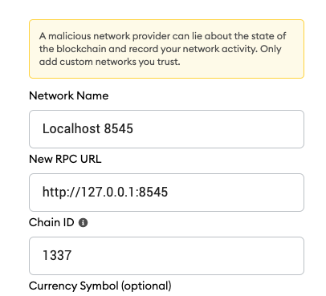
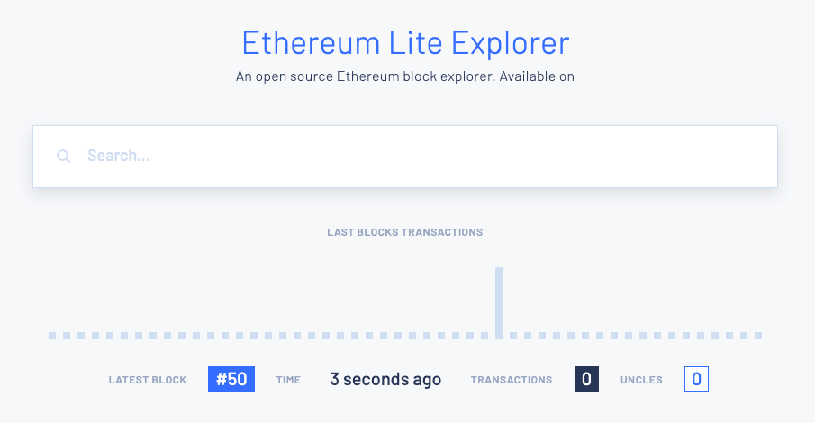

# Test Env

### Prerequisites

- curl
- java 11
- besu
- docker, docker-compose

## Settings local netwodk (docker)

> There is already a key pair generated. Do not `generate.sh`

If each validator wants to revive a gas, remove the `miningbeneficiary` in genesis file.

1. run networks

   ```bash
   ./start.sh
   ```

   - RPC URL: `localhost:8545, 8546, 8547, 8548`

     

   - Block Explorer: `localhost:25000`

     

2. stop networks

   ```bash
   ./stop.sh
   ```

3. stop and remove networks

   ```bash
   ./remove.sh
   ```

### ~~Settings local network (generate key pair)~~

Do not use Docker!

```bash
pwd

besu-private-net-ibft
```

Generate key-pair and genesis.json. (Optional)

```bash
./generate.sh
```

Start the first node1 as the bootnode.

```bash
cd node0
besu --data-path=data --genesis-file=../genesis.json --rpc-http-enabled --rpc-http-api=ETH,NET,IBFT --host-allowlist="\*" --rpc-http-cors-origins="all"
```

the default of port is 30303, 8545. <br><br>

Copy the enode URL and create a new terminal for each node.

```
ex) enode://...@127.0.0.1:30303
```

```bash
cd node1
besu --data-path=data --genesis-file=../genesis.json --bootnodes=<enode URL> --p2p-port=30304 --rpc-http-enabled --rpc-http-api=ETH,NET,IBFT --host-allowlist="*" --rpc-http-cors-origins="all" --rpc-http-port=8546
```

```bash
cd node2
besu --data-path=data --genesis-file=../genesis.json --bootnodes=<enode URL> --p2p-port=30305 --rpc-http-enabled --rpc-http-api=ETH,NET,IBFT --host-allowlist="*" --rpc-http-cors-origins="all" --rpc-http-port=8547
```

```bash
cd node3
besu --data-path=data --genesis-file=../genesis.json --bootnodes=<enode URL> --p2p-port=30306 --rpc-http-enabled --rpc-http-api=ETH,NET,IBFT --host-allowlist="*" --rpc-http-cors-origins="all" --rpc-http-port=8548
```

### Confirm the private network is working

```bash
curl -X POST --data '{"jsonrpc":"2.0","method":"ibft_getValidatorsByBlockNumber","params":["latest"], "id":1}' localhost:8545
```

Look at the logs to confirm
